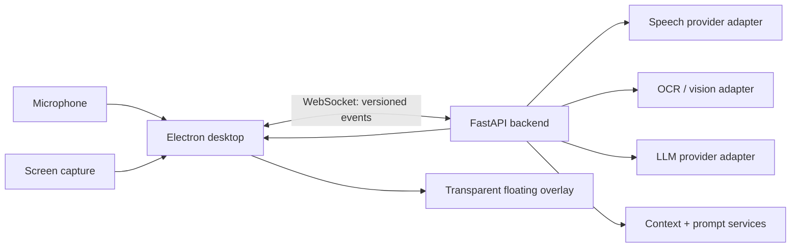
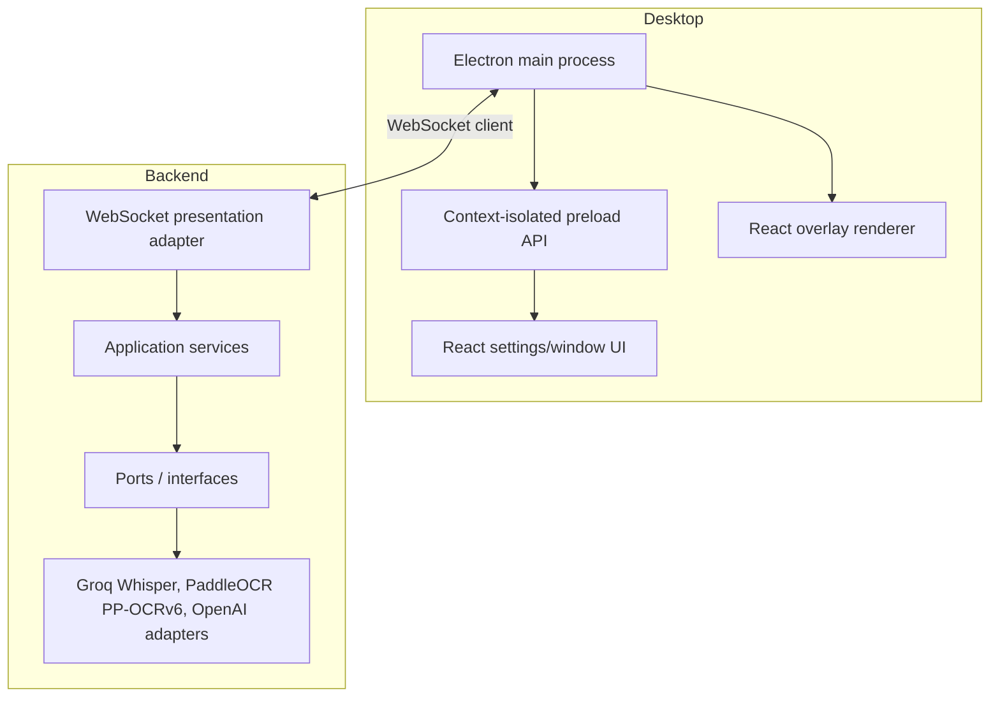

# Architecture Contract — AI Desktop Copilot V1

## 1. Scope and non-goals

V1 is a Windows-first, user-visible desktop copilot. It captures microphone
audio only after the user starts a session, obtains a user-authorized screen
image, derives local OCR context, and streams a model response to a visible
overlay. The design keeps platform access and provider SDKs at the edge of the
system so macOS and Linux adapters can be introduced later.

V1 excludes RAG, durable cross-session memory, plugins, vision-language model
analysis, voice replies, code execution, calendar integrations, and browser
extensions. Interfaces will reserve extension points; implementations are out
of scope.

## 2. System boundary



Electron owns native capabilities: microphone selection and capture, screen
capture permission, overlay windows, the tray, shortcuts, and settings UI.
The Python backend owns session orchestration, transcription, OCR, context
construction, prompt construction, and model streaming. Electron never calls
an LLM provider directly and has no provider credentials.

## 3. Components and dependency direction



Business logic depends only on application models and ports. Electron,
FastAPI, provider SDKs, OCR engines, operating-system APIs, and storage are
adapters. Construction occurs in explicit composition roots (`desktop` main
bootstrap and backend FastAPI lifespan); services are passed through dependency
injection and no process-wide mutable service singletons are permitted.

## 4. Backend layers and modules

The initial backend package will use this arrangement:

```text
backend/app/
  api/             FastAPI routes and WebSocket adapter
  application/     Session orchestration and use cases
  domain/          Typed models, ports, domain rules
  infrastructure/  Provider, OCR, screen, and persistence adapters
  modules/
    audio/         Audio ingress and speech-to-text coordination
    vision/        Screenshot intake, preprocessing, and OCR
    context/       Transcript/screen context merging and budgeting
    prompt/        Prompt assembly
    llm/           Provider-neutral streaming, timeouts, and retries
    session/       Active-session state and bounded history
    overlay/       Token-to-client publication
    settings/      Validated runtime configuration
  shared/          Backend-only protocol helpers and errors
```

Required ports are `VoiceActivityDetector`, `AudioSegmenter`, `SpeechTranscriber`, `ScreenAnalyzer`, `LlmStreamer`,
`ContextRepository`, `SessionRepository`, `EventPublisher`, `Clock`, and
`SettingsProvider`. Implementations are selected by configuration in the
composition root. A future `KnowledgeRetriever`, `MemoryStore`,
`PluginRegistry`, `VisionReasoner`, `VoiceSynthesizer`, `CodeExecutor`, and
`CalendarGateway` may be added as ports without changing application use cases.

## 5. Desktop design

The desktop application contains isolated Electron processes:

- **Main:** creates overlay/settings windows, owns tray and global shortcut,
  manages a reconnecting WebSocket client, and handles platform capture APIs.
- **Preload:** exposes an allow-listed, typed IPC surface through
  `contextBridge`; it exposes no unrestricted Electron or Node APIs.
- **Renderer:** React settings and control UI using Zustand for local UI state.
- **Overlay renderer:** independent React root that renders Markdown and code,
  supports drag/resize, and receives only normalized overlay events.

The overlay window is transparent, always-on-top, resizable, draggable, and
user-configurable for opacity, font size, theme, and position. Its visibility
is never hidden as a product behavior.

## 6. Streaming session data flow

1. The desktop starts a session and opens one authenticated local WebSocket.
2. It streams microphone frames to the backend.
3. The speech adapter emits partial and final transcripts.
4. A capture request provides a screenshot to the vision pipeline; OCR and
   screen metadata produce a screen-context update.
5. The context service merges bounded transcript history and screen context.
6. The prompt service builds a provider-neutral request.
7. The selected LLM adapter yields tokens as an async iterator.
8. The overlay publisher emits each token immediately; the desktop appends it
   to the active response and renders it incrementally.

No stage waits for full model output. Potentially blocking SDK or CPU work is
wrapped behind async adapters and dispatched away from the event loop where
required. Each session has cancellation propagation from desktop disconnect to
provider stream.

## 7. WebSocket protocol

The protocol is versioned and represented by shared schemas in both TypeScript
and Python. Every envelope has `version`, `event`, `sessionId`, `requestId`,
`timestamp`, and typed `payload` fields. Unknown versions or events are
rejected with a structured error.

| Event | Direction | Purpose |
| --- | --- | --- |
| `speech.partial` | backend → desktop | Interim transcript segment |
| `speech.final` | backend → desktop | Finalized transcript segment |
| `vision.updated` | backend → desktop | OCR/screen-analysis result |
| `context.updated` | backend → desktop | Bounded prompt context summary |
| `llm.token` | backend → desktop | One streaming text token/delta |
| `llm.completed` | backend → desktop | Completed, cancelled, or failed stream |
| `overlay.update` | backend → desktop | Display instruction derived from output |

Command events required to operate V1—such as `session.start`, `session.stop`,
`audio.chunk`, `screen.capture`, and `settings.update`—will be specified in the
API contract milestone. Binary audio/screenshot frames will use a documented
binary subprotocol rather than Base64 JSON, with metadata carried in a typed
command envelope.

## 8. Reliability, privacy, and security baseline

- API keys stay in backend environment/configuration; they are never sent to
  the renderer, persisted in logs, or exposed through IPC.
- The local backend binds to loopback by default. Desktop-backend connections
  use a per-launch secret and origin validation.
- Logs are structured and redact secrets, audio, screenshots, and raw prompt
  contents by default.
- Session history is bounded and in-memory in V1 unless a future storage port
  is configured. End-session clears transient state.
- Provider calls use explicit connect/read timeouts, bounded retries only for
  safe operations, cancellation, and typed error events.
- OCR text is treated as untrusted content and delimited in prompts; it cannot
  override system instructions.

## 9. Quality gates

The implementation will enforce Python 3.12 typing, Pydantic schemas, async
tests, linting, formatting, and architecture-level unit tests for each port.
The desktop will use TypeScript strict mode, ESLint, Prettier, hooks-based React
components, and IPC contract tests. Integration coverage will validate the
WebSocket stream and token ordering; Electron end-to-end coverage will validate
overlay behavior without a live provider.

## 10. Decisions awaiting implementation milestones

The following will be locked in the setup/API milestones rather than guessed
now: Electron package-manager choice, backend packaging tool, PaddleOCR PP-OCRv6 model artifacts,
audio codec/frame duration, Groq Whisper model and rolling-window configuration, local-backend lifecycle,
and exact settings persistence implementation. Their interfaces are already
isolated by this contract.
